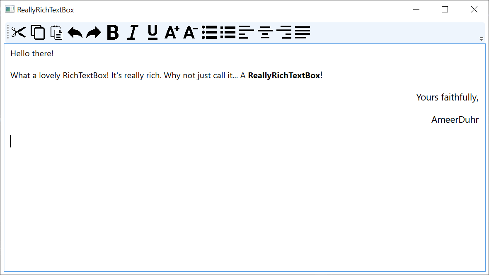

# ReallyRichTextBox
A user control in WPF that simply represents a RichTextBox with a really simple toolbar binded to native ApplicationCommands and EditingCommands.



## Usage
<ol>
<li>Move the ReallyRichTextBox.xaml file with its .cs file to your own project.</li>
<li>Move the Images folder to your project as well, and make sure everything's in it as is.</li>
<li>Make sure you include all the images before building:
<ul>
<li>Right-click the name of your project in the solution.</li>
<li>Click on `Edit Project File`</li>
<li>Copy then add this snippet after the PropertyGroup inside the file you've just opened:
<br>
	
```xml
	<ItemGroup>
		<Resource Include="Images\*.png" />
	</ItemGroup>
```

</li>
</ul>
</li>
<li>Then simply use the `ReallyRichTextBox` as a UserControl:
<br>
	
```xml
<local:ReallyRichTextBox />
```

</li>
</ol>
